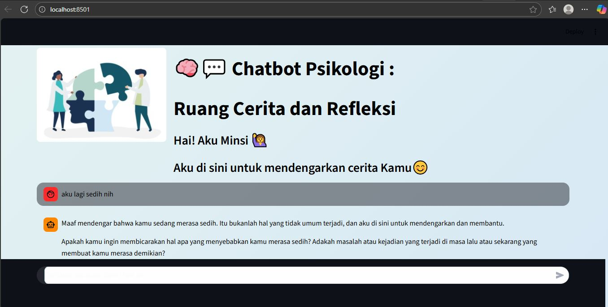

# 🧠 Chatbot Psikologi - Ruang Cerita dan Refleksi

## 📒 Final Project Hacktiv8 – AI for Data Scientist

Ini merupakan **Chatbot Psikologi** bernama **Minsi**, yang dibuat menggunakan **Streamlit** dan **Groq API**.  
Chatbot ini berfungsi sebagai pendengar interaktif yang membantu pengguna mengekspresikan perasaan mereka dengan nyaman.


---

## 🚀 Fitur

* Chat interaktif menggunakan `st.chat_input()`
* Tampilan UI lembut dan menenangkan 🎨
* Penyimpanan riwayat percakapan dalam session
* Aman dengan penggunaan file `.env` untuk API key

---

## 🧩 Langkah Penggunaan

1. Clone repository ini:

   ```bash
   git clone https://github.com/aznaz43/Chatbot_Psikologi.git
   cd Chatbot_Psikologi
   ```

2. Install dependensi:

   ```bash
   pip install -r requirements.txt
   ```

3. Buat file `.env` di folder utama:

   ```
   GROQ_API_KEY=your_api_key_here
   ```

---

## ▶️ Jalankan Chatbot

```bash
streamlit run chatbot.py
```

Kemudian buka link lokal yang muncul (biasanya `http://localhost:8501`).


## 📸 Preview Chat Bot Psikologi





```

---


© 2025 by Nurul (aznaz43)
